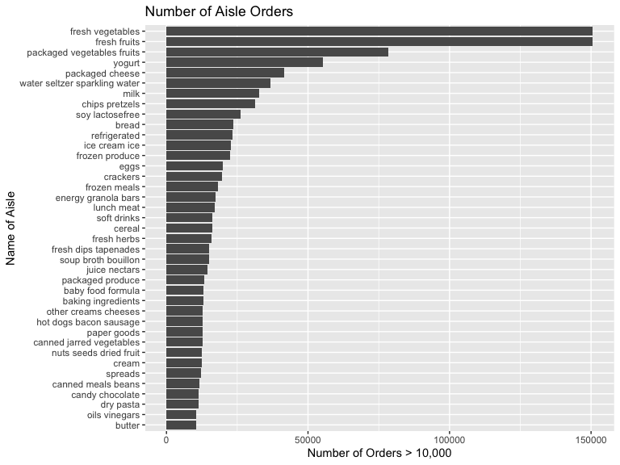

P8105\_hw3\_TS3175
================

## Load instacart data

``` r
library(p8105.datasets)
data("instacart")
```

## Getting info from instacart

``` r
  instacart %>%
  count(aisle) %>% 
  arrange(desc(n))
```

    ## # A tibble: 134 x 2
    ##    aisle                              n
    ##    <chr>                          <int>
    ##  1 fresh vegetables              150609
    ##  2 fresh fruits                  150473
    ##  3 packaged vegetables fruits     78493
    ##  4 yogurt                         55240
    ##  5 packaged cheese                41699
    ##  6 water seltzer sparkling water  36617
    ##  7 milk                           32644
    ##  8 chips pretzels                 31269
    ##  9 soy lactosefree                26240
    ## 10 bread                          23635
    ## # … with 124 more rows

### There are 134 aisles and Fresh Vegetables and Fresh Fruits are the most ordered from.

## Make a plot

``` r
instacart %>%
  count(aisle) %>% 
  filter(
   n > 10000
   ) %>% 
  ggplot(aes(y = n, x=reorder(aisle,n))) +
  geom_bar (stat = "identity")+ coord_flip()+ 
  labs(
    title="Number of Aisle Orders",
    y="Number of Orders > 10,000",
    x="Name of Aisle"
  )
```


\#\# Making Tables

``` r
instacart %>%
  filter(aisle== c("baking ingredients", "dog food care", "packaged vegetables fruits")) %>% 
  group_by (aisle, product_name) %>% 
  summarize(n=n()) %>% 
  filter(min_rank(desc(n)) <4) %>%
  knitr::kable(col.names = c("Aisle Name",
                           "Product Name",
                           "Number of Products"))
```

| Aisle Name                 | Product Name                                    | Number of Products |
| :------------------------- | :---------------------------------------------- | -----------------: |
| baking ingredients         | Light Brown Sugar                               |                157 |
| baking ingredients         | Organic Vanilla Extract                         |                122 |
| baking ingredients         | Pure Baking Soda                                |                140 |
| dog food care              | Organix Chicken & Brown Rice Recipe             |                 13 |
| dog food care              | Organix Grain Free Chicken & Vegetable Dog Food |                 14 |
| dog food care              | Original Dry Dog                                |                  9 |
| packaged vegetables fruits | Organic Baby Spinach                            |               3324 |
| packaged vegetables fruits | Organic Blueberries                             |               1692 |
| packaged vegetables fruits | Organic Raspberries                             |               1920 |

``` r
instacart %>%
  filter(product_name %in% c("Pink Lady Apple", "Coffee Ice Cream")) %>% 
  group_by(product_name, order_dow) %>%
  summarise(mean = mean(order_hour_of_day)) %>% 
  pivot_wider(
    names_from = order_dow,
    values_from = mean)%>% 
    knitr::kable(col.names = c("Product Names",
                           "Sunday",
                           "Monday",
                           "Tuesday",
                           "Wednesday",
                           "Thursday",
                           "Friday",
                           "Saturday"))
```

| Product Names    |   Sunday |   Monday |  Tuesday | Wednesday | Thursday |   Friday | Saturday |
| :--------------- | -------: | -------: | -------: | --------: | -------: | -------: | -------: |
| Coffee Ice Cream | 13.77419 | 14.31579 | 15.38095 |  15.31818 | 15.21739 | 12.26316 | 13.83333 |
| Pink Lady Apple  | 14.40000 | 14.20000 | 13.20000 |   8.00000 | 11.00000 | 16.00000 | 13.00000 |
