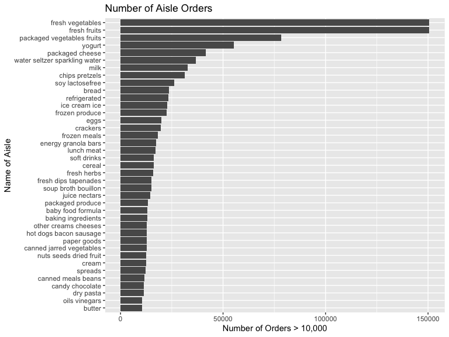
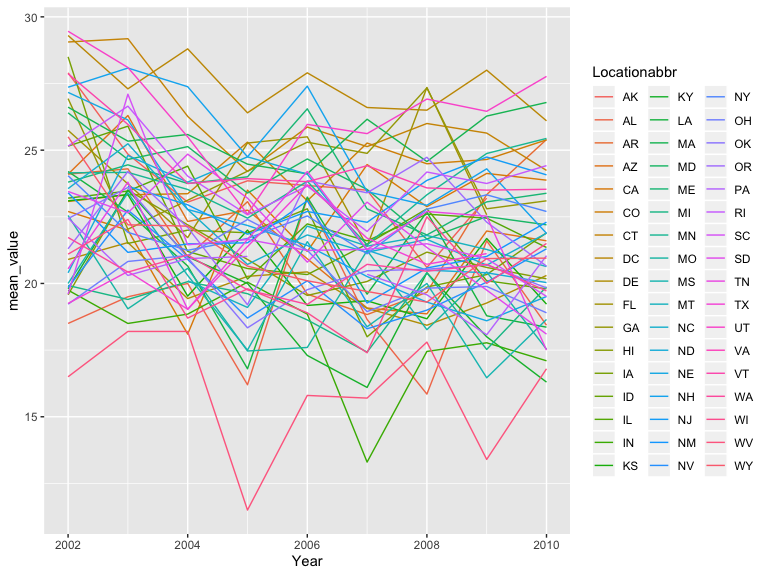
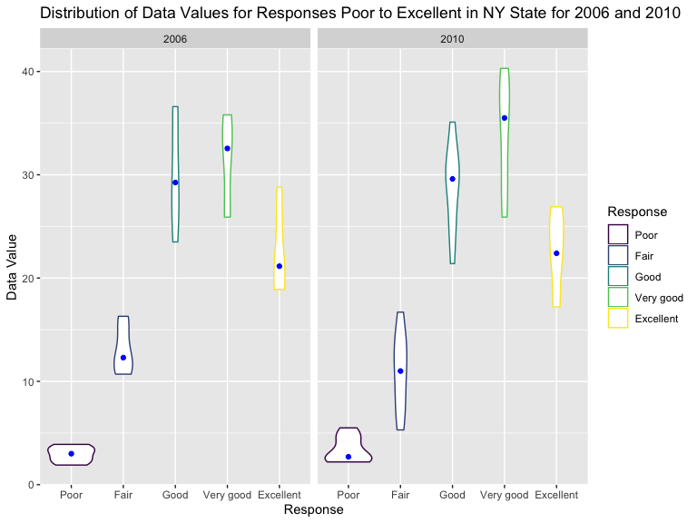
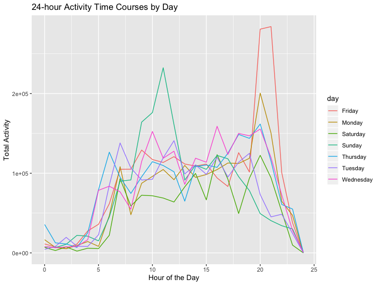

P8105\_hw3\_TS3175
================
Tanu

# Problem 1

Load instacart data

``` r
library(p8105.datasets)
data("instacart")
```

## A Short Description of My Dataset

“The Instacart Online Grocery Shopping Dataset 2017” is an anonymized
dataset with over 3 million online grocery orders from more than 200,000
Instacart users. There are 1384617 observations and 15 variables. The
key variables are as follows: order\_id: order identifier product\_id:
product identifier add\_to\_cart\_order: order in which each product was
added to cart reordered: 1 if this prodcut has been ordered by this user
in the past, 0 otherwise user\_id: customer identifier eval\_set: which
evaluation set this order belongs in (Note that the data for use in this
class is exclusively from the “train” eval\_set) order\_number: the
order sequence number for this user (1=first, n=nth) order\_dow: the day
of the week on which the order was placed order\_hour\_of\_day: the hour
of the day on which the order was placed days\_since\_prior\_order: days
since the last order, capped at 30, NA if order\_number=1 product\_name:
name of the product aisle\_id: aisle identifier department\_id:
department identifier aisle: the name of the aisle department: the name
of the department

Illustrative examples: \* The first observation shows that user with
user ID 112108 ordered Bulgarian Yogurt with the product ID 49302 from
aisle 120 of the dairy eggs department. \* The second observation shows
that user with user ID 112108 ordered Organic 4% Milk Fat Whole Milk
Cottage Cheese with the product ID 11109 from aisle 108 of the dairy
eggs department.

There are 134 aisles and Fresh Vegetables and Fresh Fruits are the most
ordered
from.

## The plot below that shows the number of items ordered in each aisle, limiting this to aisles with more than 10000 items ordered.

``` r
instacart %>%
  count(aisle) %>% 
  filter(
   n > 10000
   ) %>% 
  ggplot(aes(y = n, x=reorder(aisle,n))) +
  geom_bar (stat = "identity")+ coord_flip()+ 
  labs(
    title="Number of Aisle Orders",
    y="Number of Orders > 10,000",
    x="Name of Aisle"
  )
```



## The table below shows the three most popular items in each of the aisles “baking ingredients”, “dog food care”, and “packaged vegetables fruits”, including the number of times each item is ordered.

``` r
instacart %>%
  filter(aisle== c("baking ingredients", "dog food care", "packaged vegetables fruits")) %>% 
  group_by (aisle, product_name) %>% 
  summarize(n=n()) %>% 
  filter(min_rank(desc(n)) <4) %>%
  knitr::kable(col.names = c("Aisle Name",
                           "Product Name",
                           "Number of Products"))
```

| Aisle Name                 | Product Name                                    | Number of Products |
| :------------------------- | :---------------------------------------------- | -----------------: |
| baking ingredients         | Light Brown Sugar                               |                157 |
| baking ingredients         | Organic Vanilla Extract                         |                122 |
| baking ingredients         | Pure Baking Soda                                |                140 |
| dog food care              | Organix Chicken & Brown Rice Recipe             |                 13 |
| dog food care              | Organix Grain Free Chicken & Vegetable Dog Food |                 14 |
| dog food care              | Original Dry Dog                                |                  9 |
| packaged vegetables fruits | Organic Baby Spinach                            |               3324 |
| packaged vegetables fruits | Organic Blueberries                             |               1692 |
| packaged vegetables fruits | Organic Raspberries                             |               1920 |

## The table below shows the mean hour of the day at which Pink Lady Apples and Coffee Ice Cream are ordered on each day of the week.

``` r
instacart %>%
  filter(product_name %in% c("Pink Lady Apple", "Coffee Ice Cream")) %>% 
  group_by(product_name, order_dow) %>%
  summarise(mean = mean(order_hour_of_day)) %>% 
  pivot_wider(
    names_from = order_dow,
    values_from = mean)%>% 
    knitr::kable(col.names = c("Product Names",
                           "Sunday",
                           "Monday",
                           "Tuesday",
                           "Wednesday",
                           "Thursday",
                           "Friday",
                           "Saturday"))
```

| Product Names    |   Sunday |   Monday |  Tuesday | Wednesday | Thursday |   Friday | Saturday |
| :--------------- | -------: | -------: | -------: | --------: | -------: | -------: | -------: |
| Coffee Ice Cream | 13.77419 | 14.31579 | 15.38095 |  15.31818 | 15.21739 | 12.26316 | 13.83333 |
| Pink Lady Apple  | 14.40000 | 14.20000 | 13.20000 |   8.00000 | 11.00000 | 16.00000 | 13.00000 |

# Problem 2

## Load in BRFSS data

``` r
library(p8105.datasets)
data("brfss_smart2010")
```

## Cleaned the BRFSS data to focus on the “Overall Health” topic, include only responses from “Excellent” to “Poor”, and organized responses as a factor taking levels ordered from “Poor” to “Excellent

``` r
brfss2 = brfss_smart2010 %>% 
  filter(Topic %in% "Overall Health") %>% 
  filter(Response %in% c("Excellent", "Very good", "Good", "Fair", "Poor")) %>%
  mutate(
    Response = ordered(Response, c("Poor", "Fair", "Good", "Very good", "Excellent")))
```

``` r
brfss2 %>% 
  filter(Year == "2002") %>% 
  group_by (Year, Locationabbr) %>% 
  summarise(n=n()) %>% 
  filter(n>6) %>% 
  knitr::kable(col.names= c("Year", "State", "Number of Observations at 7 or more locations"))
```

|    Year | State    |            Number of Observations at 7 or more locations |
| ------: | :------- | -------------------------------------------------------: |
|    2002 | AZ       |                                                       10 |
|    2002 | CO       |                                                       20 |
|    2002 | CT       |                                                       35 |
|    2002 | DE       |                                                       15 |
|    2002 | FL       |                                                       35 |
|    2002 | GA       |                                                       15 |
|    2002 | HI       |                                                       20 |
|    2002 | ID       |                                                       10 |
|    2002 | IL       |                                                       15 |
|    2002 | IN       |                                                       10 |
|    2002 | KS       |                                                       15 |
|    2002 | LA       |                                                       15 |
|    2002 | MA       |                                                       40 |
|    2002 | MD       |                                                       30 |
|    2002 | ME       |                                                       10 |
|    2002 | MI       |                                                       20 |
|    2002 | MN       |                                                       20 |
|    2002 | MO       |                                                       10 |
|    2002 | NC       |                                                       35 |
|    2002 | NE       |                                                       15 |
|    2002 | NH       |                                                       25 |
|    2002 | NJ       |                                                       40 |
|    2002 | NV       |                                                       10 |
|    2002 | NY       |                                                       25 |
|    2002 | OH       |                                                       20 |
|    2002 | OK       |                                                       15 |
|    2002 | OR       |                                                       15 |
|    2002 | PA       |                                                       50 |
|    2002 | RI       |                                                       20 |
|    2002 | SC       |                                                       15 |
|    2002 | SD       |                                                       10 |
|    2002 | TN       |                                                       10 |
|    2002 | TX       |                                                       10 |
|    2002 | UT       |                                                       25 |
|    2002 | VT       |                                                       15 |
|    2002 | WA       |                                                       20 |
| In 2002 | , the 36 | which states above were observed at 7 or more locations. |

``` r
brfss2 %>% 
  filter(Year == "2010") %>% 
  group_by (Year, Locationabbr) %>% 
  summarise(n=n()) %>% 
  filter(n>6) %>% 
  knitr::kable(col.names= c("Year", "State", "Number of Observations at 7 or more locations"))
```

|    Year | State    |            Number of Observations at 7 or more locations |
| ------: | :------- | -------------------------------------------------------: |
|    2010 | AL       |                                                       15 |
|    2010 | AR       |                                                       15 |
|    2010 | AZ       |                                                       15 |
|    2010 | CA       |                                                       60 |
|    2010 | CO       |                                                       35 |
|    2010 | CT       |                                                       25 |
|    2010 | DE       |                                                       15 |
|    2010 | FL       |                                                      205 |
|    2010 | GA       |                                                       20 |
|    2010 | HI       |                                                       20 |
|    2010 | IA       |                                                       10 |
|    2010 | ID       |                                                       30 |
|    2010 | IL       |                                                       10 |
|    2010 | IN       |                                                       15 |
|    2010 | KS       |                                                       20 |
|    2010 | LA       |                                                       25 |
|    2010 | MA       |                                                       45 |
|    2010 | MD       |                                                       60 |
|    2010 | ME       |                                                       30 |
|    2010 | MI       |                                                       20 |
|    2010 | MN       |                                                       25 |
|    2010 | MO       |                                                       15 |
|    2010 | MS       |                                                       10 |
|    2010 | MT       |                                                       15 |
|    2010 | NC       |                                                       60 |
|    2010 | ND       |                                                       15 |
|    2010 | NE       |                                                       50 |
|    2010 | NH       |                                                       25 |
|    2010 | NJ       |                                                       95 |
|    2010 | NM       |                                                       30 |
|    2010 | NV       |                                                       10 |
|    2010 | NY       |                                                       45 |
|    2010 | OH       |                                                       40 |
|    2010 | OK       |                                                       15 |
|    2010 | OR       |                                                       20 |
|    2010 | PA       |                                                       35 |
|    2010 | RI       |                                                       25 |
|    2010 | SC       |                                                       35 |
|    2010 | SD       |                                                       10 |
|    2010 | TN       |                                                       25 |
|    2010 | TX       |                                                       80 |
|    2010 | UT       |                                                       30 |
|    2010 | VT       |                                                       30 |
|    2010 | WA       |                                                       50 |
|    2010 | WY       |                                                       10 |
| In 2010 | , the 45 | which states above were observed at 7 or more locations. |

## Constructed a dataset that is limited to Excellent responses, and contains, year, state, and a variable that averages the data\_value across locations within a state.

``` r
brfss=
brfss2%>% 
      filter(Response == "Excellent") %>% 
      group_by(Year, Locationabbr) %>% 
      summarise(mean_value=mean(Data_value))
```

## The plot below shows the average values (from the step before) over time within a state.

``` r
brfss %>% 
ggplot(aes(x=Year, y=mean_value)) + geom_line(aes(group=Locationabbr, color=Locationabbr))
```



## The two-panel plot below shows, for the years 2006, and 2010, the distribution of data\_value for responses (“Poor” to “Excellent”) among locations in NY State.

``` r
brfss_smart2010 %>% 
  filter(Year %in% c("2006", "2010"), Locationabbr == "NY") %>% 
  filter(Response %in% c("Excellent", "Very good", "Good", "Fair", "Poor")) %>% 
   mutate(
    Response = ordered(Response, c("Poor", "Fair", "Good", "Very good", "Excellent"))) %>% 
  
  ggplot(aes(x=Response, y=Data_value)) + geom_violin(aes(color=Response))+stat_summary(fun.y = median, geom = "point", color = "blue") + 
facet_grid(~Year) +
  labs(
    title="Distribution of Data Values for Responses Poor to Excellent in NY State for 2006 and 2010",
    y="Data Value",
    x="Response"
  ) 
```



# Problem 3

## Loaded, tidied, and otherwise wrangled the data to create a dataset including all originally observed variables and values, with a new variable “Day\_of\_Week” coded as weekday vs weekend.

``` r
accel_data = read_csv(file = "./Data/accel_data.csv") %>% 
janitor::clean_names() %>% 
mutate(
  Day_of_Week = if_else(day %in% c("Saturday","Sunday"), "Weekend", "Weekday")
) %>% 
  pivot_longer(
    activity_1:activity_1440,
    names_to = "Minute",
    names_prefix = "activity_",
    values_to = "Activity") %>%
  mutate( week= as.integer(week),
          day_id= as.integer(day_id),
          day= as.character(day),
          Day_of_Week=as.character(Day_of_Week),
          Activity=as.numeric(Activity),
          Minute=as.numeric(Minute)
  )
```

    ## Parsed with column specification:
    ## cols(
    ##   .default = col_double(),
    ##   day = col_character()
    ## )

    ## See spec(...) for full column specifications.

There are 50400 observations and 6 variables. It contains the following
variables: week, day\_id, day, Day\_of\_Week, Minute, Activity.

## The table below shows total activities during the day for each day.

``` r
accel_data %>% 
  group_by(week, day) %>% 
  summarise (total_activity = sum(Activity)) %>%
  knitr::kable(col.names= c("Week", "Day of the Week", "Total Activities"))
```

|    Week | Day of the Week    |                                                                                                                                       Total Activities |
| ------: | :----------------- | -----------------------------------------------------------------------------------------------------------------------------------------------------: |
|       1 | Friday             |                                                                                                                                              480542.62 |
|       1 | Monday             |                                                                                                                                               78828.07 |
|       1 | Saturday           |                                                                                                                                              376254.00 |
|       1 | Sunday             |                                                                                                                                              631105.00 |
|       1 | Thursday           |                                                                                                                                              355923.64 |
|       1 | Tuesday            |                                                                                                                                              307094.24 |
|       1 | Wednesday          |                                                                                                                                              340115.01 |
|       2 | Friday             |                                                                                                                                              568839.00 |
|       2 | Monday             |                                                                                                                                              295431.00 |
|       2 | Saturday           |                                                                                                                                              607175.00 |
|       2 | Sunday             |                                                                                                                                              422018.00 |
|       2 | Thursday           |                                                                                                                                              474048.00 |
|       2 | Tuesday            |                                                                                                                                              423245.00 |
|       2 | Wednesday          |                                                                                                                                              440962.00 |
|       3 | Friday             |                                                                                                                                              467420.00 |
|       3 | Monday             |                                                                                                                                              685910.00 |
|       3 | Saturday           |                                                                                                                                              382928.00 |
|       3 | Sunday             |                                                                                                                                              467052.00 |
|       3 | Thursday           |                                                                                                                                              371230.00 |
|       3 | Tuesday            |                                                                                                                                              381507.00 |
|       3 | Wednesday          |                                                                                                                                              468869.00 |
|       4 | Friday             |                                                                                                                                              154049.00 |
|       4 | Monday             |                                                                                                                                              409450.00 |
|       4 | Saturday           |                                                                                                                                                1440.00 |
|       4 | Sunday             |                                                                                                                                              260617.00 |
|       4 | Thursday           |                                                                                                                                              340291.00 |
|       4 | Tuesday            |                                                                                                                                              319568.00 |
|       4 | Wednesday          |                                                                                                                                              434460.00 |
|       5 | Friday             |                                                                                                                                              620860.00 |
|       5 | Monday             |                                                                                                                                              389080.00 |
|       5 | Saturday           |                                                                                                                                                1440.00 |
|       5 | Sunday             |                                                                                                                                              138421.00 |
|       5 | Thursday           |                                                                                                                                              549658.00 |
|       5 | Tuesday            |                                                                                                                                              367824.00 |
|       5 | Wednesday          |                                                                                                                                              445366.00 |
| There a | re 5 total weeks t | o look at and all 7 days in the data set. The trend is hard to see with this table, but it looks as though the least activities happened on Saturdays. |

## The single-panel plot below shows the 24-hour activity time courses for each day and uses color to indicate day of the week.

``` r
accel_data %>%
  mutate(
    hour = Minute %/% 60 
    ) %>% 
  group_by(day, hour) %>% 
  summarise (total_activity = sum(Activity)) %>% 
  ggplot(aes(x=hour, y=total_activity)) + geom_line(aes(color=day)) + 
  labs(
    title="24-hour Activity Time Courses by Day",
    y="Total Activity",
    x="Hour of the Day"
  ) 
```


Based on this graph, we can see that activity is at its highest oon
Friday during hour 20 of the day, or 10pm, followed by Sunday at hour
10, or 10am. We can also see a general trend that this person begins
being active at about 5 am and is steadily active until about 10pm. This
graph also suggests that this person probably sleeps around 11pm or 12am
as the lines on the graph decrease and the person wakes up around 4:45am
or 6am most days. There is also a clear trend that Saturday is this
person’s least active day.
